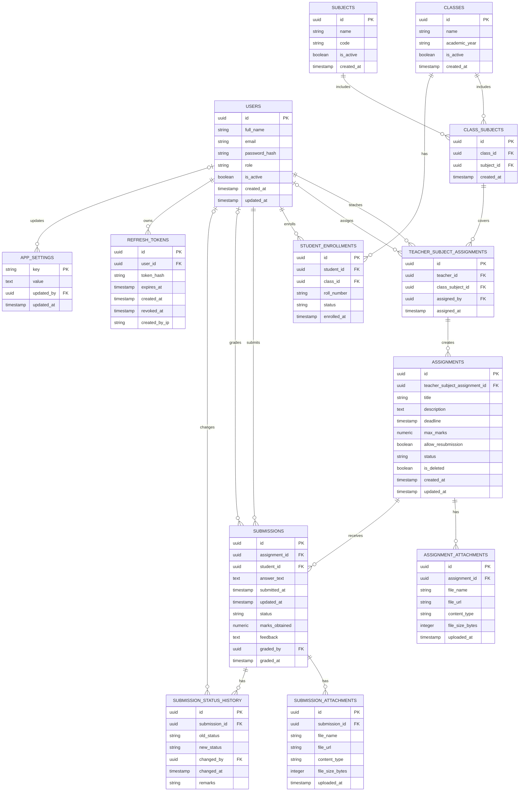

# Assignment & Submission Management System

A 3-tier REST API backend built with **ASP.NET Core** and **PostgreSQL**.

---

## 🗄️ Database Architecture (ERD)

Below is the Entity-Relationship Diagram (ERD) for the database schema:

---

## Key Schema & Architectural Decisions

| Decision | Rationale |
| :--- | :--- |
| **Bridge Table (`class_subjects`)** | A subject like "Physics" is taught in multiple classes, and a class has multiple subjects. That's a many-to-many relationship, and the only clean way to store one is a bridge table.  |
| **Chained Hierarchy (`class_subjects` → `teacher_subject_assignments` → `assignments`)** | Enforces core domain integrity at the database level. Teachers can only be assigned to valid class-subject pairs, and assignments automatically inherit verified authorization rules. |
| **Unique Constraint on `(assignment_id, student_id)`** | Guarantees one submission per student per assignment, making resubmissions an atomic **insert or update** operation. |
| **Separate `refresh_tokens` entity** | A JWT access token should be short-lived (here defined as 15 minutes) for security. A refresh token, stored server-side is used to remember that user in server side so it can be revoked (e.g., on logout, or if compromised) — something a bare JWT can't do on its own since it's stateless. This table is what makes "logout" actually mean something. |
| **UUID Primary Keys** | With integers, `/api/submissions/14` tells anyone the id-guessing game is trivial — someone could iterate through every submission by changing one digit. UUIDs close that off. |
| **Soft Deletes (`is_deleted` / `is_active`)** | Preserves historical grading and submission data even if parent entities or assignments are removed. |
| **Dynamic `appsettings` Table** | Provides a key-value store for application-wide administrator configurations without requiring schema migrations. |
