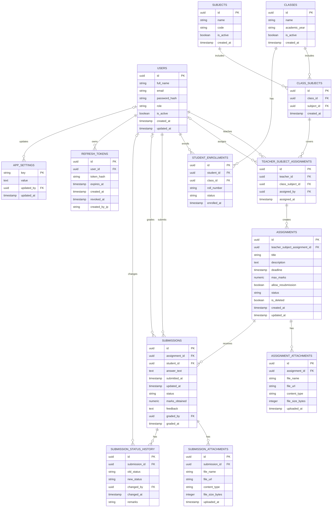
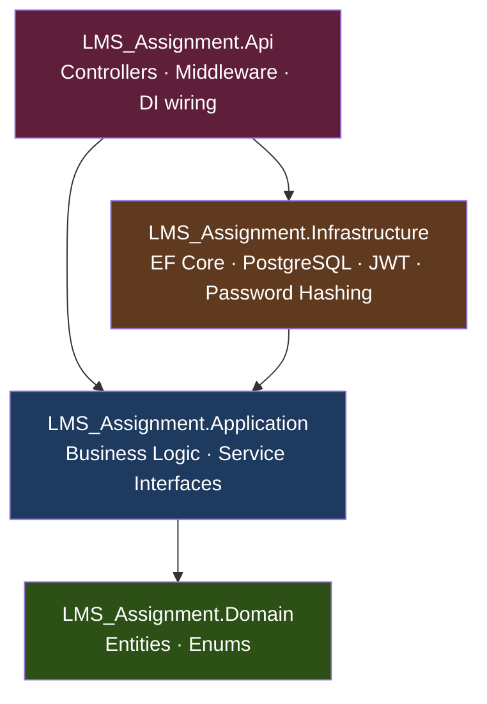

# Assignment & Submission Management System

A full-stack academic platform for managing classes, subjects, assignments, and grading — built as a submission for the OnnoRokom Projukti Limited Assistant Software Engineer recruitment task.

---

## 1. Overview

This system solves a problem every school and coaching center has: teachers need a place to post assignments and grade student work, students need a place to see what's due and submit it, and administrators need to be able to set up the classes, subjects, and people involved without touching a database directly.

The system has three roles, each with a distinct view of the application:

- **Admin** — the operator of the system. Creates and manages classes, subjects, and the links between them (which subjects are taught in which class), assigns teachers to the subjects they teach, enrolls students into classes, and can activate/deactivate any account or resource without permanently deleting historical data.
- **Teacher** — creates assignments for the classes and subjects they've been assigned to, sets deadlines and maximum marks, reviews what students have submitted, and grades each submission with a mark and written feedback.
- **Student** — sees the assignments relevant to their enrolled class, submits their answer before the deadline, and later sees their grade and feedback once a teacher has reviewed it.

Every action is scoped by role at the API level — a Teacher cannot grade an assignment they didn't create, and a Student cannot see another student's submission — this is enforced in the backend, not just hidden in the UI.

The project is a genuine two-part system, not a single monolith: a **REST API backend** (ASP.NET Core 9, Clean Architecture, PostgreSQL) that owns all the business logic and data, and a **separate single-page frontend** (React + TypeScript) that consumes that API the same way any other client would. Both are deployed and live — see [Section 3](#3-live-demo) for links you can try right now.

---

## 2. Architecture

### a. Database Architecture

Below is the Entity-Relationship Diagram (ERD) for the database schema:



---

#### Key Schema & Architectural Decisions

| Decision | Rationale |
| :--- | :--- |
| **Bridge Table (`class_subjects`)** | A subject like "Physics" is taught in multiple classes, and a class has multiple subjects. That's a many-to-many relationship, and the only clean way to store one is a bridge table.  |
| **Chained Hierarchy (`class_subjects` → `teacher_subject_assignments` → `assignments`)** | Enforces core domain integrity at the database level. Teachers can only be assigned to valid class-subject pairs, and assignments automatically inherit verified authorization rules. |
| **Unique Constraint on `(assignment_id, student_id)`** | Guarantees one submission per student per assignment, making resubmissions an atomic **insert or update** operation. |
| **Separate `refresh_tokens` entity** | A JWT access token should be short-lived (here defined as 15 minutes) for security. A refresh token, stored server-side is used to remember that user in server side so it can be revoked (e.g., on logout, or if compromised) — something a bare JWT can't do on its own since it's stateless. This table is what makes "logout" actually mean something. |
| **UUID Primary Keys** | With integers, `/api/submissions/14` tells anyone the id-guessing game is trivial — someone could iterate through every submission by changing one digit. UUIDs close that off. |
| **Soft Deletes (`is_deleted` / `is_active`)** | Preserves historical grading and submission data even if parent entities or assignments are removed. |
| **Dynamic `appsettings` Table** | Provides a key-value store for application-wide administrator configurations without requiring schema migrations. |

---

### b. Application Architecture

The backend follows **Clean Architecture** (also known as Onion Architecture): the codebase is split into four projects, and dependencies are only allowed to point **inward**, toward the center. The outer layers know about the inner layers; the inner layers never know the outer layers exist.



**What each layer is actually responsible for:**

| Layer | Responsibility | Depends on |
| :--- | :--- | :--- |
| **Domain** | The entities (`User`, `Assignment`, `Submission`, etc.) and enums (`AssignmentStatus`, `UserRole`, ...) that describe the problem itself. No framework code, no database code, no HTTP code — just plain C# classes. | Nothing. This is the center of the onion. |
| **Application** | The actual business rules: "a Teacher can only grade submissions for assignments they created," "pagination defaults to 20 items and clamps at 100." Implemented as services (`AssignmentService`, `SubmissionService`, ...), each behind an interface (`IAssignmentService`, `ISubmissionService`). | Only `Domain`. |
| **Infrastructure** | The technical implementation details: talking to PostgreSQL through EF Core, hashing passwords, generating JWTs. This layer *implements* interfaces that `Application` defines — it never defines the business rules itself. | `Application` (to implement its interfaces) and `Domain`. |
| **Api** | The entry point: HTTP controllers, request/response DTOs, middleware, and the dependency-injection wiring that connects interfaces to their concrete implementations at startup. | All three inner layers — this is the only layer allowed to know everything. |

**The clearest real example of this in the codebase — Dependency Inversion in practice, not theory:**

Database access is defined by an interface, `IApplicationDbContext`, declared *inside the Application layer* ([`Common/Interfaces/IApplicationDbContext.cs`](src/LMS_Assignment.Application/Common/Interfaces/IApplicationDbContext.cs)). The actual EF Core `DbContext` that talks to PostgreSQL — `AppDbContext` — lives in the Infrastructure layer and *implements* that interface ([`Persistence/AppDbContext.cs`](src/LMS_Assignment.Infrastructure/Persistence/AppDbContext.cs)):

```csharp
// Application layer — defines WHAT is needed, has no idea how it's fulfilled
public interface IApplicationDbContext
{
    DbSet<User> Users { get; }
    DbSet<Assignment> Assignments { get; }
    // ...
}

// Infrastructure layer — provides HOW, using EF Core + PostgreSQL
public class AppDbContext : DbContext, IApplicationDbContext { /* ... */ }
```

This is the Dependency Inversion Principle applied for real, not as a diagram exercise: `AssignmentService` and every other service in the `Application` layer only ever talk to `IApplicationDbContext`. They have no idea PostgreSQL, EF Core, or even a real database exists. If the project switched to SQL Server tomorrow, only the `Infrastructure` layer would change — not a single line of business logic in `Application` would need to move.

**Tracing one real request end-to-end** — a Teacher grading a submission (`POST /api/submissions/{id}/grade`):

1. **`SubmissionsController`** (Api) receives the HTTP request, extracts the current user's identity, and calls `ISubmissionService.GradeAsync(...)`.
2. **`SubmissionService`** (Application) runs the actual business rule — checks that this Teacher owns the `TeacherSubjectAssignment` behind the submission's assignment, rejects the request otherwise — then updates the entity through `IApplicationDbContext`.
3. **`AppDbContext`** (Infrastructure) translates that into a real SQL `UPDATE` against PostgreSQL through EF Core's change tracker.
4. Control returns back up through the same chain, and the controller serializes the result to JSON.

At no point does step 2 (the business rule) know or care that step 3 involves PostgreSQL specifically — that's the entire point.

**Why this is worth the extra ceremony, in two concrete results from this project:**

- **111 unit tests, zero of which touch a real database.** Because every service depends on the `IApplicationDbContext` interface rather than a concrete `DbContext`, tests substitute an in-memory implementation and verify business logic in isolation — fast, and immune to database flakiness.
- **The `Application` layer stays 100% PostgreSQL-agnostic.** Filter queries (e.g. searching submissions by student name) deliberately use `.ToLower().Contains(...)` instead of Npgsql's `EF.Functions.ILike(...)`, even though the latter is more idiomatic for PostgreSQL specifically — because `ILike` would leak a PostgreSQL-specific concept into a layer that's supposed to have no idea PostgreSQL exists. That constraint is a direct, practical consequence of the architecture, not an arbitrary style choice.

---

## 3. Live Demo

The full system is deployed and publicly reachable — no local setup is required to try it out.

| | URL |
| :--- | :--- |
| **Frontend (React app)** | [https://assignment-and-submission-managemen.vercel.app](https://assignment-and-submission-managemen.vercel.app) |
| **Backend (REST API)** | [https://lmsmanagement.onrender.com/api](https://lmsmanagement.onrender.com/api) |

### Demo Credentials

| Role | Email | Password |
| :--- | :--- | :--- |
| **Admin** | `admin@lms.demo` | `Admin@123` |
| **Teacher** | `ahsan@lms.com` | `ahsan@123` |
| **Student** | `lihazinaveedpersonal@gmail.com` | `Lihazi@123` |

Log in as **Admin** first to see the full picture — classes, subjects, teacher assignments, and student enrollments are all set up from that account. Then log out and log back in as the **Teacher** or **Student** account to see the same data from their respective, permission-scoped point of view.

### Notes on the live deployment

- **Backend cold starts:** the API is hosted on Render's free tier, which spins the server down after ~15 minutes of no traffic. The *first* request after a period of inactivity can take 20–30 seconds while it wakes back up — this is expected, not a bug. Every request after that is fast.
- **Database:** the live backend is backed by a real PostgreSQL database (hosted on [Neon](https://neon.tech)), not an in-memory or mock store — data created, edited, or graded through the live site persists exactly as it would with any production deployment.
- **Architecture of the deployment itself:** the frontend (static React build) is hosted separately from the backend (a Dockerized ASP.NET Core API) — they communicate purely over the same public REST API described in this document, the same way the frontend would talk to the backend if you ran both locally. This mirrors the actual separation of concerns described in [Section 2](#2-architecture).

---

## 4. Features

### Admin

- Create, edit, deactivate/reactivate, and delete **Classes** and **Subjects**.
- Link subjects to classes (**Class-Subjects**) — a subject can be taught in multiple classes, and a class can have multiple subjects.
- Assign **Teachers** to a specific class-subject pairing, so a teacher only ever sees and manages the classes/subjects they've actually been assigned to.
- Enroll **Students** into a class, with an optional roll number.
- View and manage all **User** accounts (Teachers and Students), including deactivating an account to block sign-in without deleting their history.
- View **every Assignment** across the whole system, with status and search filtering.
- A dashboard with live counts (teachers, students, classes, subjects, assignments, submissions) and breakdown charts (assignments by status, submissions by status, enrollments by class).

### Teacher

- Create, edit, publish, and delete **Assignments** for any class-subject they're assigned to — with a title, description, deadline, maximum marks, and whether resubmission is allowed.
- View all **Submissions** for a chosen assignment, with status filtering (Submitted / Late / Graded).
- **Grade** a submission — enter marks (validated against the assignment's maximum) and written feedback. Re-grading an already-graded submission is supported.

### Student

- View all **Assignments** relevant to their enrolled class, filterable by status.
- **Submit** an answer to an assignment before its deadline.
- View their own **Submissions** and, once graded, see their marks and the teacher's feedback.

### Cross-cutting

- **Role-based authorization enforced server-side** — every endpoint checks the caller's role and ownership (e.g. a Teacher can only grade submissions belonging to their own assignments), not just hidden behind UI routing.
- **JWT authentication** with short-lived access tokens (15 minutes) and server-side revocable refresh tokens, so logout is a real, enforceable action.
- **Pagination and filtering** on every list-returning endpoint (Assignments, Submissions, Users, Classes, Subjects, Class-Subjects, Teacher Assignments, Student Enrollments) — page size defaults to 20 and is capped at 100 server-side, so the API can't be made to return unbounded result sets.
- **Soft deletes and activate/deactivate toggles** throughout, so removing a class, subject, or user account never destroys the historical grading and submission records tied to it.

---

## 5. Tech Stack

### Backend

| | |
| :--- | :--- |
| **Language / Runtime** | C#, .NET 9 |
| **Framework** | ASP.NET Core 9 Web API |
| **Database** | PostgreSQL, via EF Core 9 + Npgsql |
| **Authentication** | JWT bearer tokens (`System.IdentityModel.Tokens.Jwt`), refresh tokens stored server-side |
| **Password Hashing** | BCrypt (`BCrypt.Net-Next`) |
| **Logging** | Serilog — structured logs to console and a rolling daily file |
| **API Documentation** | Scalar (interactive OpenAPI UI, with JWT bearer support wired in) |
| **Testing** | xUnit — 111 unit tests covering every service |
| **Architecture** | Clean Architecture across 4 projects (`Domain` / `Application` / `Infrastructure` / `Api`) — see [Section 2b](#b-application-architecture) |

### Frontend

| | |
| :--- | :--- |
| **Language** | TypeScript |
| **Framework** | React 19 + Vite |
| **Routing** | React Router v7 |
| **Styling** | Tailwind CSS v4 |
| **Component Library** | shadcn/ui, built on the Base UI (`@base-ui/react`) primitive library |
| **Forms & Validation** | React Hook Form + Zod |
| **State Management** | Zustand (auth/session state) |
| **HTTP Client** | Axios, with an interceptor that transparently refreshes an expired access token using the stored refresh token |
| **Charts** | Recharts (Admin dashboard) |

### Deployment & Infrastructure

| | |
| :--- | :--- |
| **Backend hosting** | [Render](https://render.com) — free-tier Web Service, deployed from a `Dockerfile` at the repo root |
| **Database hosting** | [Neon](https://neon.tech) — free-tier serverless PostgreSQL |
| **Frontend hosting** | [Vercel](https://vercel.com) — static hosting for the Vite build, deployed straight from the `frontend/` directory of this repo |
| **CI** | Both Render and Vercel auto-deploy on every push to `main` |

---

## 6. Local Setup

Everything here has been run and verified end-to-end while writing this document — these are not untested instructions.

### Prerequisites

Make sure the following are installed before starting:

- **[.NET 9 SDK](https://dotnet.microsoft.com/download/dotnet/9.0)**
- **[Node.js](https://nodejs.org/)** 18 or later (includes `npm`)
- **PostgreSQL** — either a local instance, or a free cloud database such as [Neon](https://neon.tech) (this is exactly what the live deployment uses)
- **Git**

### Backend Setup

1. **Clone the repository and open a terminal at the repo root.**

2. **Configure the database connection and JWT secret.** These are never committed to the repo — `appsettings.Development.json` is deliberately gitignored, so a fresh clone won't have real credentials in it. The recommended way to supply your own is .NET's built-in **User Secrets** tool, which stores them outside the project folder entirely:

   ```bash
   dotnet user-secrets init --project src/LMS_Assignment.Api

   dotnet user-secrets set "ConnectionStrings:DefaultConnection" "Host=localhost;Port=5432;Database=lms_assignment;Username=postgres;Password=<your-postgres-password>" --project src/LMS_Assignment.Api

   dotnet user-secrets set "Jwt:Key" "<any-random-string-at-least-32-characters-long>" --project src/LMS_Assignment.Api
   ```

   (If you're using a cloud Postgres provider like Neon instead of a local install, just use the connection string it gives you in place of the `Host=localhost;...` example above.)

3. **Apply the database migrations.** This creates the entire schema — every table, foreign key, index, and enum type — with no manual SQL required:

   ```bash
   dotnet tool install --global dotnet-ef   # only needed if you don't already have it
   dotnet ef database update --project src/LMS_Assignment.Infrastructure --startup-project src/LMS_Assignment.Api
   ```

4. **Run the API:**

   ```bash
   dotnet run --project src/LMS_Assignment.Api --urls http://localhost:5139
   ```

   On this first run, the app automatically seeds one Admin account — `admin@lms.demo` / `Admin@123` — so there's nothing further to set up before logging in. Restarting the app never duplicates or resets this account.

5. **Confirm it's working** by opening the interactive API docs at `http://localhost:5139/scalar/v1` (Scalar's OpenAPI UI, available in Development mode) — you should be able to see and try every endpoint from there, including authenticating with the seeded Admin account.

### Frontend Setup

1. **Open a new terminal** (keep the backend running in the first one) and move into the frontend folder:

   ```bash
   cd frontend
   ```

2. **Set the API URL.** Copy the example env file — it already points at the backend's default local port, so no edits are needed unless you changed the port above:

   ```bash
   cp .env.example .env.local
   ```

3. **Install dependencies and start the dev server:**

   ```bash
   npm install
   npm run dev
   ```

4. **Open `http://localhost:5173`** and log in with the seeded Admin account from step 4 of the backend setup.

---

## 7. Running Tests

The backend has a dedicated test project, [`tests/LMS_Assignment.Tests`](tests/LMS_Assignment.Tests), organized to mirror the `Application` layer one-to-one — a folder per feature (`Assignments`, `Auth`, `Classes`, `ClassSubjects`, `StudentEnrollments`, `Subjects`, `Submissions`, `TeacherSubjectAssignments`, `Users`), each testing the corresponding service directly.

### Running the full suite

```bash
dotnet test tests/LMS_Assignment.Tests
```

Expected output:

```
Passed!  - Failed:     0, Passed:   111, Skipped:     0, Total:   111
```

### What's actually being tested

These are **unit tests against the Application layer's business logic**, not integration tests against a real running server or a real PostgreSQL database:

- **xUnit** is the test framework.
- **EF Core's In-Memory provider** stands in for `IApplicationDbContext` — each test gets a fresh, isolated in-memory database, so tests run fast and never depend on PostgreSQL being installed or reachable.
- **Moq** mocks the remaining interfaces where relevant (e.g. `ICurrentUserService`, to simulate "the currently logged-in user is this Teacher" without a real HTTP request or JWT).

This setup is only possible *because* of the layering described in [Section 2b](#b-application-architecture): every service depends on interfaces (`IApplicationDbContext`, `ICurrentUserService`, etc.), never on a concrete `AppDbContext` or PostgreSQL-specific code. Swapping in an in-memory implementation for tests is exactly the kind of substitution that Dependency Inversion is meant to make possible.

### Coverage focus

Each service's test file covers, at minimum:
- The core CRUD path (create, read, update, delete/deactivate) for that resource.
- Authorization edge cases — e.g. a Teacher attempting to grade a submission for an assignment they don't own is expected to fail, and there's a test asserting exactly that.
- Pagination and filtering behavior — since [Section 4](#4-features) covers this on every list endpoint, each relevant test file includes a case verifying the correct page is returned with the correct total count.

---

## 8. Assumptions & Deviations

Every non-obvious judgment call made while building this system, stated explicitly so nothing reads as an accidental gap:

- **React + Vite instead of Next.js.** The recruitment brief lists "Next.js, React" as the frontend requirement, and explicitly allows equivalent technology. Plain React + Vite was used instead — it's a lighter setup appropriate for a client-side-only SPA that talks to a fully separate backend API, and none of this project's requirements (SSR, file-based routing, API routes) actually call for what Next.js specifically adds on top of React. This is a deliberate choice, not a missed requirement.

- **No repository pattern beyond `IApplicationDbContext`.** Some Clean Architecture implementations add a full `IRepository<T>` abstraction on top of the `DbContext`. This project deliberately doesn't — `IApplicationDbContext` already provides the exact same benefit (Application layer code has zero knowledge of EF Core or PostgreSQL, see [Section 2b](#b-application-architecture)) without the extra indirection of hand-writing a repository interface for every entity, most of which would just forward calls to EF Core's `DbSet<T>` anyway.

- **No data-fetching library on the frontend** (no React Query, SWR, etc.). Instead, two small hand-rolled hooks — `useAsyncList` and `usePagedList` — handle loading state, errors, and refetching. This was a deliberate scope decision to keep the dependency footprint small for a project of this size, not an oversight; a larger production app with more complex caching/invalidation needs would likely benefit from adopting one.

- **Demo data seeded minimally, not exhaustively.** Only one Admin account is auto-created on a fresh database ([Section 6](#6-local-setup)); Teacher, Student, and all classes/subjects/assignments seen in the [live demo](#3-live-demo) were created manually through the Admin UI after deployment — the same workflow any real administrator would use, rather than baking a large synthetic dataset into the seeder.

---

## 9. Known Limitations

Stated plainly, rather than left for a reviewer to discover:

- **No notifications system.** Neither in-app nor email notifications exist for events like "a new assignment was published" or "your submission was graded" — a student or teacher only finds out by checking the relevant page.
- **No file attachments.** The database schema already models `AssignmentAttachment` and `SubmissionAttachment` (visible in the [ERD](#a-database-architecture)) for exactly this purpose, but no file-upload API endpoints or frontend UI were built against them — assignments and submissions are text-only (title/description/answer text) in the current implementation.
- **No dedicated mobile-responsive pass.** Tailwind's utility classes are used throughout, which gives a reasonable baseline, but no screen has been specifically tested or tuned at narrow (phone-width) viewports.
- **Silent session-expiry UX.** When a refresh token expires or is invalid, the frontend's axios interceptor clears the session and the next protected route redirects to `/login` — but without a toast or message explaining *why* the user was logged out. Functionally correct, but a rough edge from a user's perspective.
- **No audit trail for status changes.** The schema includes a `SubmissionStatusHistory` table intended to track every status transition a submission goes through, but no service currently writes to it, and there's no endpoint or screen exposing it — it's modeled in the database but not yet wired up anywhere in the application.
